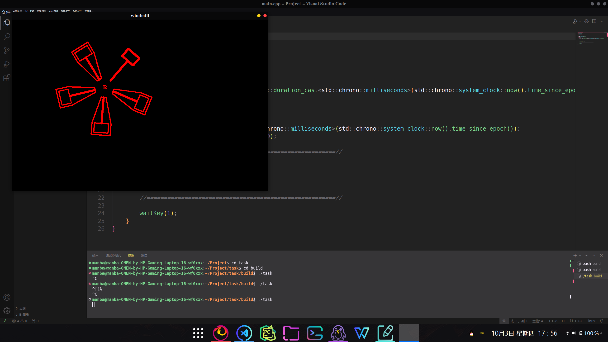
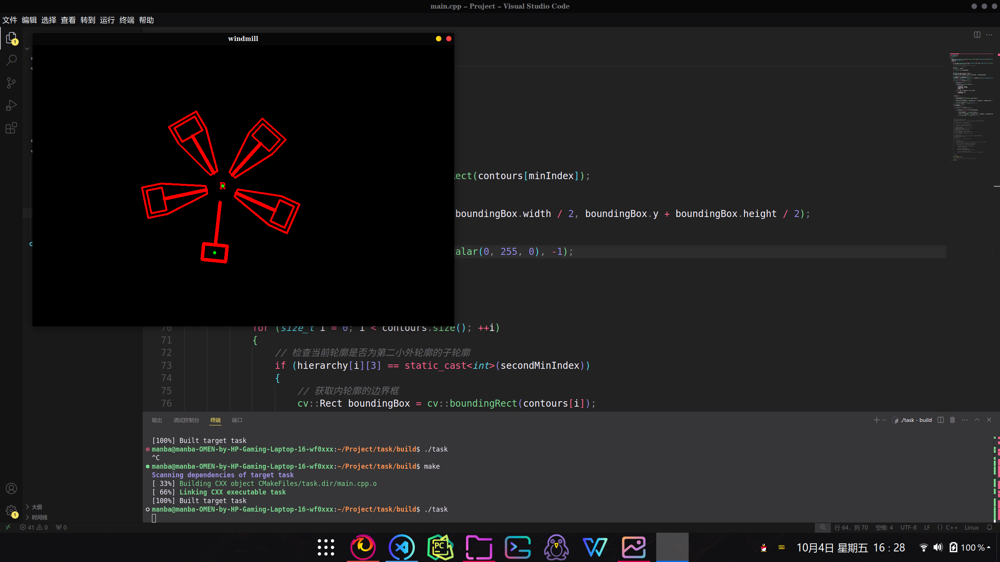

# RMV-Task03
## 前置准备
下载代码后cmake编译运行无误

ceres1.14的安装参照任务书与博客[ubuntu 20.04 安装 ceres库](https://blog.csdn.net/qq_39607707/article/details/123736439?ops_request_misc=%257B%2522request%255Fid%2522%253A%252278E46017-84FB-44DA-AEF3-793B19A0B3E4%2522%252C%2522scm%2522%253A%252220140713.130102334..%2522%257D&request_id=78E46017-84FB-44DA-AEF3-793B19A0B3E4&biz_id=0&utm_medium=distribute.pc_search_result.none-task-blog-2~all~top_positive~default-1-123736439-null-null.142^v100^pc_search_result_base2&utm_term=ubuntu20.04%E5%AE%89%E8%A3%85ceres%E5%BA%93&spm=1018.2226.3001.4187)、[Ubuntu20.04安装Ceres1.14版本并测试是否成功](https://blog.csdn.net/qq_62964142/article/details/132325484?ops_request_misc=&request_id=&biz_id=102&utm_term=ubuntu20.04%E5%AE%89%E8%A3%85ceres&utm_medium=distribute.pc_search_result.none-task-blog-2~all~sobaiduweb~default-7-132325484.142^v100^pc_search_result_base2&spm=1018.2226.3001.4187)安装，安装好后运行AI示例程序出现报错：`fatal error: Eigen/Core: 没有那个文件或目录` 
参考博客[fatal error: Eigen/Core: 没有那个文件或目录](https://blog.csdn.net/bulletstart/article/details/130163712)，发现是CMakeLists中未添加eigen库路径，根据需求让AI重写一份CMakeLists，成功运行示例程序，问题解决。
## R标与锤子的识别
首先在程序中查找轮廓，检索模式使用RETR_CCOMP，即同时保留内外轮廓信息。注意到R标和锤子的外轮廓面积最小，于是先在程序中查找外轮廓面积最小的两部分图像。其中最小轮廓(R标)直接绘制外轮廓中心点，第二小轮廓(锤子)绘制其矩形内轮廓中心点。程序大多采用AI生成，结果如下。

## 问题构建与求解
由于角速度对t的变化量难以测量，因此对角速度进行积分，得到角度a关于t的表达式$a = \left(\frac{A}{w}\right)\sin(wt + \phi) + bt + c$。通过每一帧R，H坐标计算角度a，并用所给时间减去初始时间得到t，从而用ceres方法拟合函数参数。

使用AI为已有代码生成ceres求解部分，在损失函数结构体中根据推导公式更改残差计算公式，并设置每100帧迭代一次。初始迭代效果较差，于是更改求解器配置，经测验发现使用`options.linear_solver_type = ceres::DENSE_SCHUR;`比AI给出的其他选项(比如原来的`ceres::DENSE_QR`)拟合效果更好。

最后设置break条件。若成功收敛，则循环break；若不收敛，则计数器在2000帧时报错停止。代码由AI生成后根据实际情况修改而成。

从收敛的结果看，A,w,b(A0)均有很好的收敛结果，而fai通常收敛在1.7+-n*2*pi附近，暂时认为可以收敛，但结果不佳。
## 仍存在的问题
存在收敛错误的情况，即不收敛或收敛至其他参数组。发现若收敛则大多在1500帧以内完成，故设置2000帧为标准，超出2000帧直接结束此次迭代。
